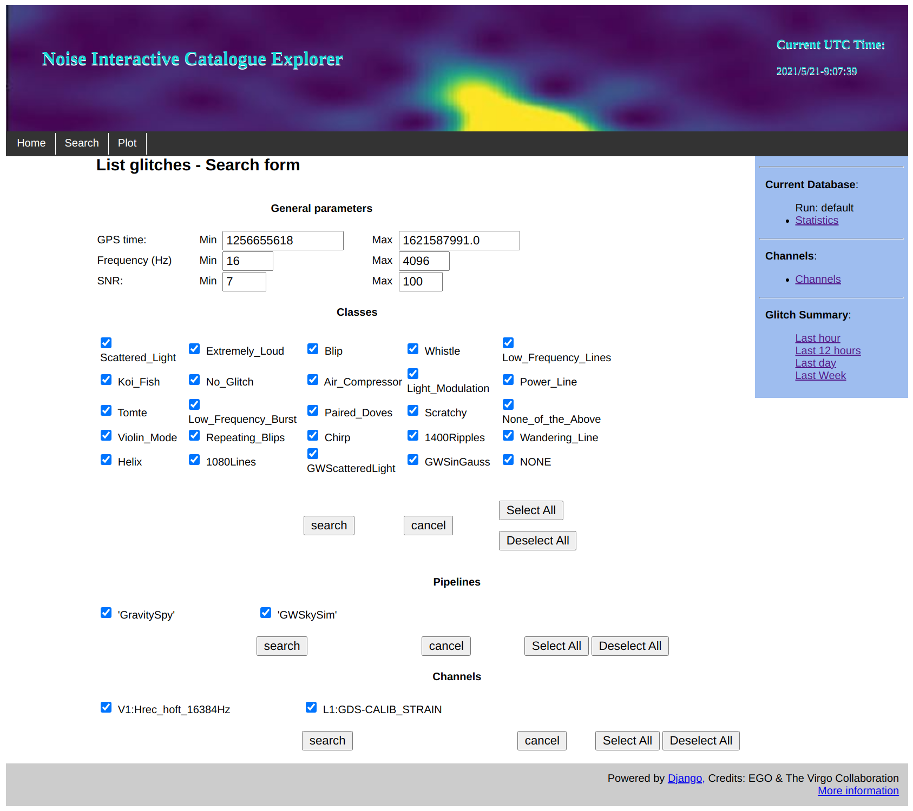
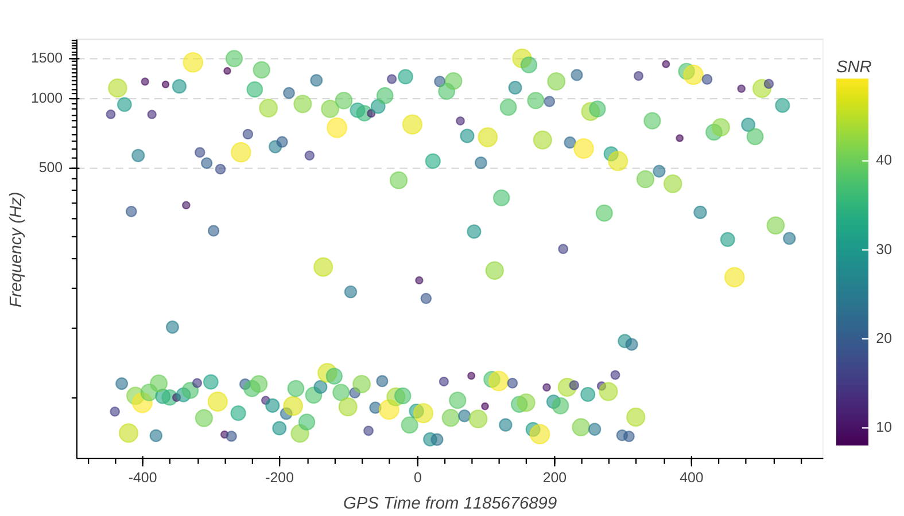
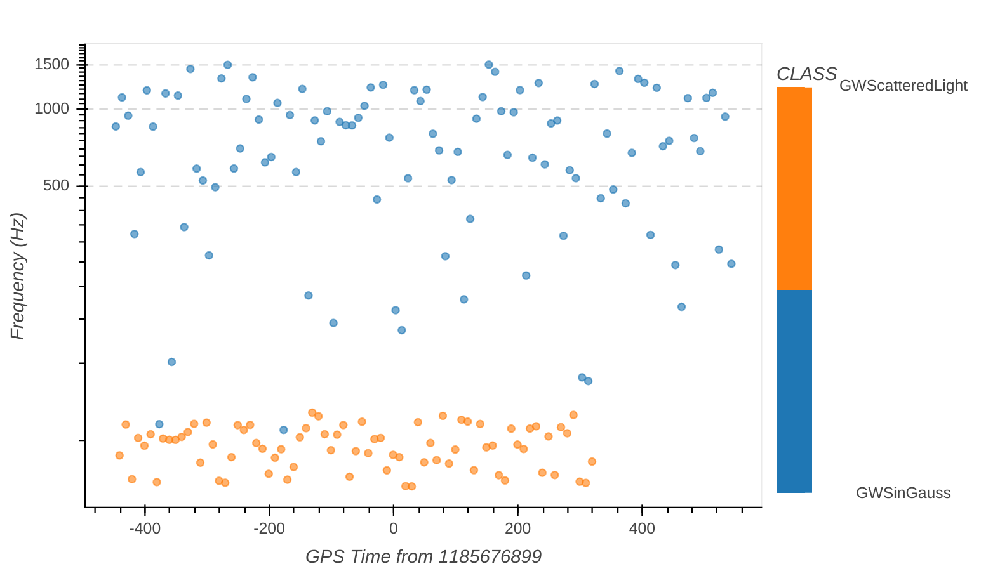
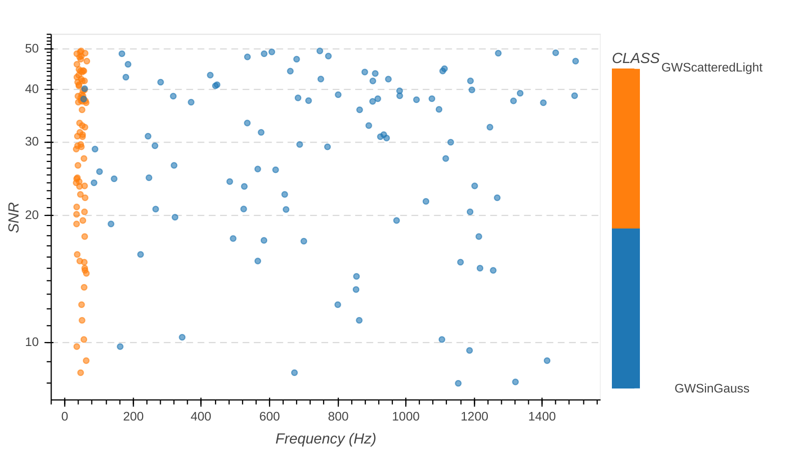
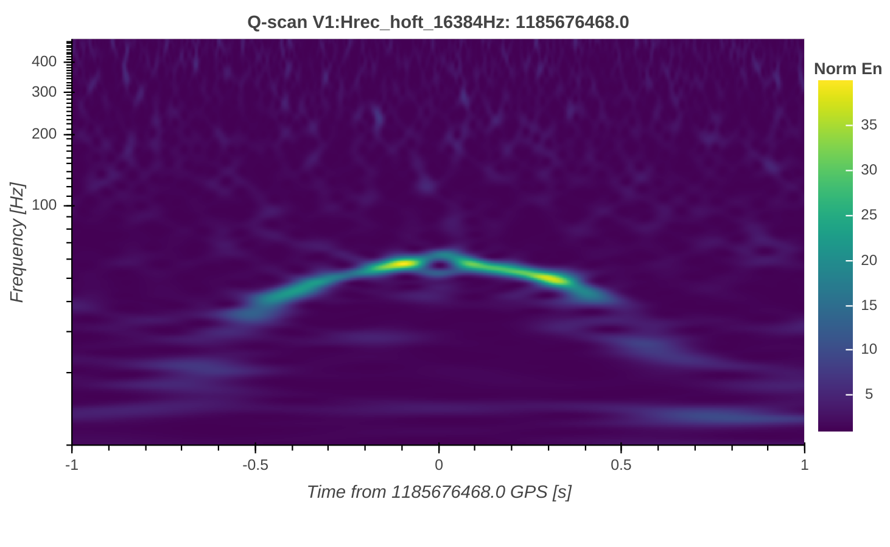
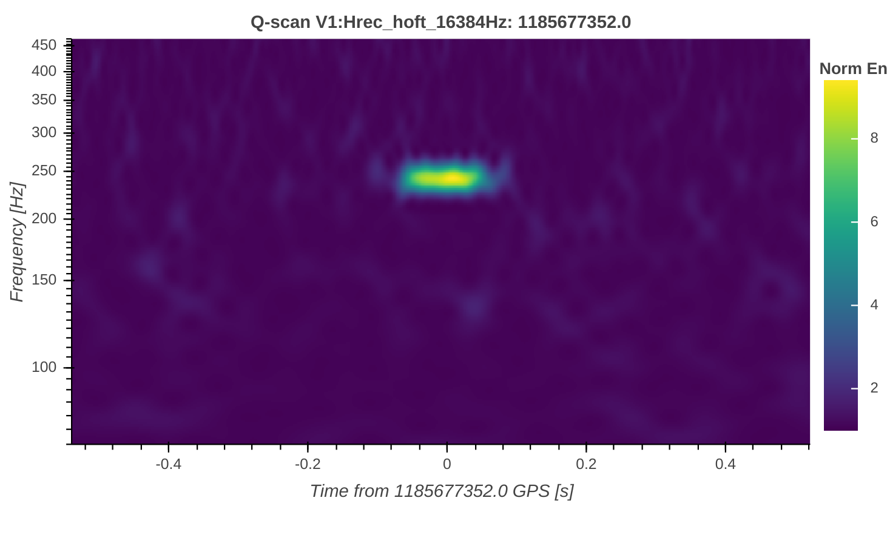

Investigation Flow
==================

Ones the database is correctly configured, let's see how to use the 
interface for the various investigations you may do!

How do I get my glitches of interest? 
-------------------------------------
Open the NICE Homepage and click on **Search** window. Here it is possible to 
make requests to the database and get the desired
information about the selected glitches: 

Here you can query glitches by:

1. GPS time interval;
2. Frequency range;
3. Minumun and Maximum Signal to Noise Ratio (SNR);

You can also select the glitches families in such intervals,
the unclassified ones (*NONE* label), the pipeline that generated them and
the reference channel. 

Click on *search* button and get the list of selected glitches metadata.
You can download such table by clicking on *Download CSV*.

How are glitches distributed around a gravitational wave event?
---------------------------------------------------------------

Click on **Plot** window in NICE Homepage. Here comes a database request page 
similar to **Search** page (see paragraph above). Ones made your request with the
GPS time interval around your gravitational wave event, the **IPW** opens up.
Here it is possible to interactively visualize the glitches distribution 
around the event. Here there is an example:  

 
The plot is interactive in the sense that it is possible to change the 
axis and points values. You can enphasize the family that glitches
belong to by changing the color bar. Here there is an exemple with 2
simulates glitches families:  

You can also change the axis values with all glitches metadata available 
in database tables, like showing the SNR distribution above peak frequency.  

You can even sub-select the dataset requested by using the relative widgets, 
like plotting the auxiliary channel glitches around the gravitational wave event.

How can I analyze the origin and the morphology of a single glitch?
-------------------------------------------------------------------

You can access to the **SGAW** by clicking on the GPS time of search list
or on the scatter point of the **IPW**. This page is dadicated to the 
rapid analysis of the single glitch, using both strain and auxiliary channels. 
Here there are 2 examples of simulated glitches, which are common in the Virgo
strain channel. The first is an arch due to the effect of laser scattered 
light and the second one is well modelled with a sin-gaussian time function.

The comparison of time concident glitches through the channels, which have
the same time-frequency morphology, is a first clue for the glitch origin
investigation. In **SGAW** there is the dedicated button for the comparison
the Q-scan images coming from the auxiliary channels available in 
the database. 
